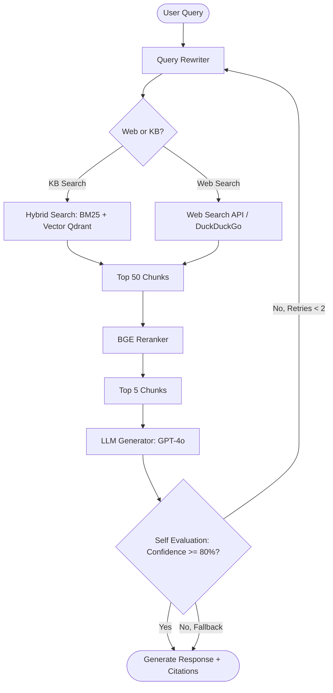

# Aegis RAG: Enterprise AI Agentic RAG Platform

Aegis RAG is a production-ready, agentic Retrieval-Augmented Generation (RAG) platform designed for secure enterprise search and conversational analysis. It features hybrid dense/sparse search, BGE reranking, Redis-backed session memory, LangGraph workflows, and RAGAS telemetry metrics.

---

## 🏗️ Architecture Overview

The platform coordinates five containers bridged via a Docker network:

```
                  ┌──────────────────────┐
                  │ Next.js 15 Frontend  │  (Port 3000)
                  └──────────┬───────────┘
                             │ REST / SSE
                             ▼
                  ┌──────────────────────┐
                  │   FastAPI Backend    │  (Port 8000)
                  └────┬─────┬──────┬────┘
                       │     │      │
        ┌──────────────┘     │      └──────────────┐
        ▼                    ▼                     ▼
┌──────────────┐     ┌──────────────┐      ┌──────────────┐
│  PostgreSQL  │     │    Redis     │      │    Qdrant    │
│  (Metadata)  │     │   (Memory)   │      │ (Vector DB)  │
│ (Port 5432)  │     │ (Port 6379)  │      │ (Port 6333)  │
└──────────────┘     └──────────────┘      └──────────────┘
```

---

## 🧠 Agentic RAG Workflow (LangGraph)

The query execution uses an agentic graph created with **LangGraph** to classify queries, retrieve documents, rerank contexts, and check factual correctness before returning answers.



### Flow Node Explanations
1. **Query Analysis & Classification**: Reads the user query and assesses if it relates to real-time information. If yes, it tags the query for web search.
2. **Context Retrieval**: Queries Qdrant (cosine similarity of dense embeddings) and PostgreSQL (local BM25 ranking on metadata), fusing rankings via **Reciprocal Rank Fusion (RRF)**.
3. **BGE Reranker**: Scores the top 50 candidates using `sentence-transformers` CrossEncoder (`BAAI/bge-reranker-large`), keeping the top 5 most relevant.
4. **LLM Generation**: Feeds the top 5 contexts to OpenAI GPT-4o (with automatic offline synthesizer fallback).
5. **Self-Evaluation**: Runs textual overlap checks and similarity heuristics. If confidence is below 80%, it triggers the query rewriter and loops back.

---

## ⚡ Quick Start Guide (Local Setup)

Follow these steps to run the platform locally on your machine:

### Prerequisites
- Install [Docker](https://www.docker.com/) and Docker Compose.
- Install [Python 3.12](https://www.python.org/) (optional, if running backend without Docker).
- Retrieve your [OpenAI API Key](https://platform.openai.com/) and [LlamaParse Key](https://cloud.llamaindex.ai/) (optional, offline fallback mode is built-in).

### Step 1: Clone and Set Up Environment Variables
Create a `.env` file in the root directory `/Users/mayankparashar/Desktop/enterprise-rag/`:

```env
# API Keys (Optional but recommended for full AI capacity)
OPENAI_API_KEY=your_openai_api_key_here
LLAMAPARSE_API_KEY=your_llamaparse_api_key_here
TAVILY_API_KEY=your_tavily_search_api_key_here
```

### Step 2: Spin Up Containers using Docker Compose
In your terminal, navigate to the project root and run:

```bash
docker-compose up --build -d
```

This will build the frontend and backend, provision databases, and start all services:
- **Next.js 15 Frontend**: `http://localhost:3000`
- **FastAPI Backend Swagger Docs**: `http://localhost:8000/docs`
- **Qdrant Vector Console**: `http://localhost:6333/dashboard`

### Step 3: Run the Ingestion Pipeline
1. Open the UI at `http://localhost:3000` and register a new user account.
2. Log in and go to **Knowledge Bases**.
3. Create a Knowledge Base (e.g., "Company Knowledge").
4. Go to **Upload Documents** and drag-and-drop a PDF, Word, TXT, or CSV file.
5. Watch the processing status column dynamically change from `Indexing` to `Ready`.

### Step 4: Start Chatting & Debugging
- Go to the **Chat Engine** page to query your database. Aegis will stream answers with page number citations.
- Check out the **Retrieval Viewer** to see the vector similarity scores side-by-side before and after reranking.
- Access the **RAGAS Evaluation** tab to compute Faithfulness, Recall, and Precision statistics.

---

## 🛠️ Diagnostics & Telemetry (Observability)

Every execution stores telemetry logs in the `query_logs` PostgreSQL table:
- **Query Latency**: Total request time.
- **Embedding Latency**: Duration of BGE Large vector generation.
- **Retrieval Latency**: Qdrant execution speed.
- **Hallucination Risk**: Faithfulness metrics derived via self-evaluation.

These metrics feed into interactive SVG graphs on the **Analytics Dashboard**.
# Agis-Rag
